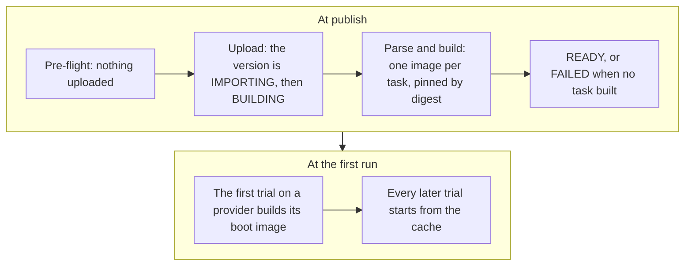

A dataset is a named, versioned folder of [tasks](/core-concepts/tasks) in the catalog. You name a version as `name@version`. A bare name means the dataset's active version.

## Browse the catalog

```bash
evolve dataset list
evolve dataset show terminal-bench-4@4.0
```

`dataset list` prints every dataset you can run: the platform's public datasets and your own. `--search <text>` filters by name and description. `dataset show` prints one dataset's versions, its tasks with their timeouts, and for each task which sandbox providers can run it.

## Publish your own

Any folder of task directories can be published. What you publish is private to your organization. Check it first: the pre-flight is a dry run that uploads nothing and writes nothing.

```bash
evolve dataset check ./my-swe
```

Then publish from a local directory, from a git repository, or from a source the server fetches itself.

<Tabs>
  <Tab title="Local directory">
    ```bash
    evolve dataset publish \
      --dir ./my-swe \
      --name my-swe \
      --version 1.0 \
      --watch
    ```

    When the folder carries a `dataset.toml` manifest, `--name` and `--version` come from it and may be omitted.
  </Tab>
  <Tab title="Git repository">
    ```bash
    evolve dataset publish \
      --git https://github.com/acme/my-swe.git \
      --ref v1.0.0 \
      --name my-swe \
      --version 1.0 \
      --watch
    ```

    `--ref` must be pinned: a tag, or a full 40-character commit sha. A branch name is refused. `--path <subfolder>` imports one folder of a larger repository.
  </Tab>
  <Tab title="Fetchable source">
    ```bash
    evolve dataset publish --from hub:cookbook/hello-world --watch
    ```

    `--from` takes a public https tarball URL, or `hub:org/name[@ref]` for a public package on the Harbor hub. For a hub package the name and version default to the package's own.
  </Tab>
</Tabs>

`--watch` follows the publish until the version is READY or FAILED. Each task builds on its own, so one broken task does not block the others; `--watch` ends with how many built. If the terminal is gone, `evolve dataset watch <name>` re-attaches to the same follow, from any machine. `--skip-preflight` uploads without the check; a task the check would have refused then fails at import instead.

## What happens when you publish



The pre-flight sends each task's `task.toml`, and the `dataset.toml` if there is one, to the server, which answers with a verdict per task and writes nothing. A refused task stops the publish before anything is uploaded.

The upload is stored on the server, the new version is recorded as IMPORTING, then BUILDING while the task images build, and the dataset is stamped as yours.

The importer reads every task directory: first the shape of its `task.toml`, against a strict schema, then its meaning.

Each task's `environment/` is built into an image, pushed to the platform's registry and pinned by its digest. Tasks build independently: one that fails any step is recorded FAILED with a typed reason, and the others keep building.

The version lands READY when at least one task built, and FAILED only when none did. On your own dataset, READY also makes the version active, so the bare name runs it. A job refuses any version that is not READY.

Nothing is built for any sandbox provider at publish. The first trial of a task on a provider builds that provider's boot image from the task image, once, and every later trial on that provider starts from the cache.

## Versions

Each publish creates a version, and a version that lands READY is built and active. To point the bare name at a different READY version:

```bash
evolve dataset activate my-swe 1.0
```

The owner of a dataset can download the original package back:

```bash
evolve dataset download my-swe@1.0 -o corpora/
```

<Card title="dataset reference" icon="terminal" href="/cli-reference/dataset">
  Every flag of `evolve dataset`.
</Card>
