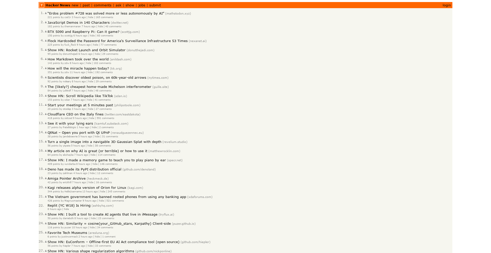
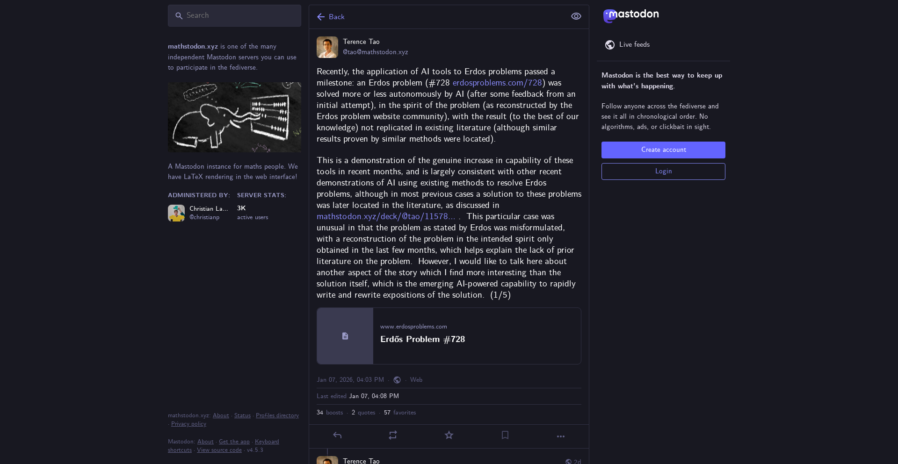

# Erdős Problem #728 Solved Autonomously by AI

## Overview

Terence Tao, the renowned mathematician, has shared a significant development in mathematical research: **Erdős Problem #728 has been solved more or less autonomously by AI**. This breakthrough represents a milestone in the application of artificial intelligence to mathematical problem-solving.

The post discusses how AI systems have contributed to solving one of the classic Erdős problems—a collection of famous open problems in mathematics proposed by the legendary Hungarian mathematician Paul Erdős. This achievement highlights the growing capability of machine learning and AI systems to tackle complex mathematical challenges that have remained open for decades.

## Significance

The autonomous or semi-autonomous solution of mathematical problems by AI represents a paradigm shift in how mathematics research can be conducted. Rather than relying solely on human intuition and manual proof construction, AI systems can now contribute meaningfully to problem-solving efforts by:

- Analyzing mathematical patterns and relationships
- Exploring solution spaces more exhaustively than humans might manually
- Identifying promising research directions
- Assisting in verification and validation of proofs

This particular achievement with Problem #728 underscores both the power of modern AI systems and the continuing relevance of classic mathematical problems as benchmarks for AI capability.

## Community Response

The post generated significant interest in the Hacker News community, earning 221 points and receiving 165 comments as users discussed the implications of AI-assisted mathematical proof discovery, the nature of mathematical understanding, and the future of AI in mathematics research.

This represents an important moment in the intersection of artificial intelligence and mathematical discovery, where machines are beginning to play a more active role in advancing human knowledge in one of humanity's oldest intellectual pursuits.
