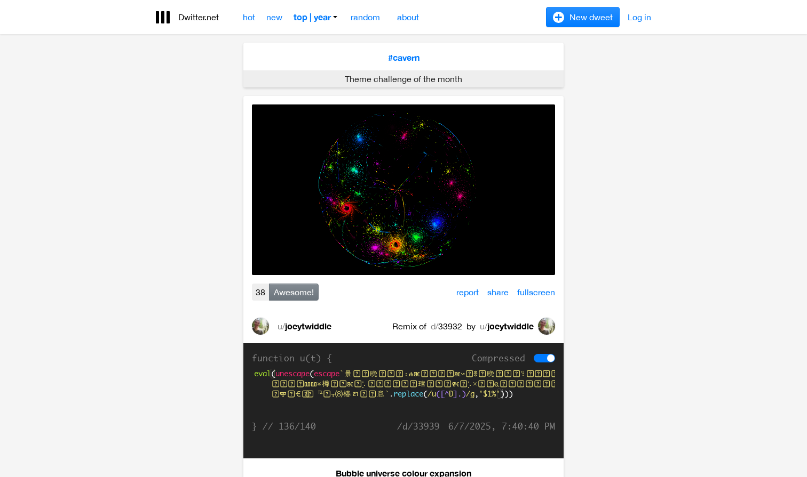
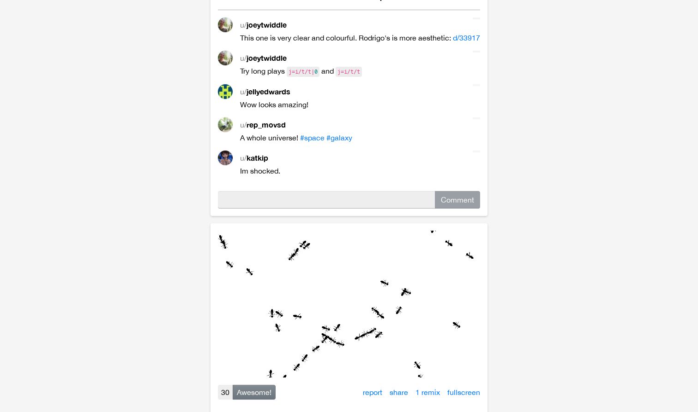

# JavaScript Demos in 140 Characters

## Overview

This Hacker News post features "JavaScript Demos in 140 Characters," a collection of remarkably creative and concise JavaScript demonstrations hosted on Dwitter.net. Dwitter is a unique platform dedicated to showcasing tiny JavaScript programs (limited to 140 characters) that produce interesting visual effects and animations.

## Main Content

The post appeared at rank 2 on Hacker News with significant community engagement:
- **181 points** from upvoters
- **40 comments** from the community

## Key Visual Elements

The Dwitter platform showcases extraordinary visual demonstrations created using minimal JavaScript code. The character limit constraint (140 chars) forces developers to be incredibly creative with their code, resulting in stunning animations, generative art, and interactive visual experiences that are both impressive and technically clever.

## Additional Content

The post generates significant discussion in the community, with 40 comments discussing the creative approaches, the challenge of fitting complete programs into 140 characters, and sharing appreciation for the artistic and technical achievements displayed. The combination of creative constraints and visual output makes this a popular topic among developers interested in code golf, creative coding, and JavaScript capabilities.

## Why It Matters

This demonstrates the creative potential of JavaScript and how strict constraints can lead to innovative problem-solving. Dwitter serves as both an educational platform and an artistic showcase, proving that powerful visuals and interactive experiences don't always require large codebases. The popularity of this post on Hacker News reflects the developer community's appreciation for clever engineering and creative expression within technical boundaries.
