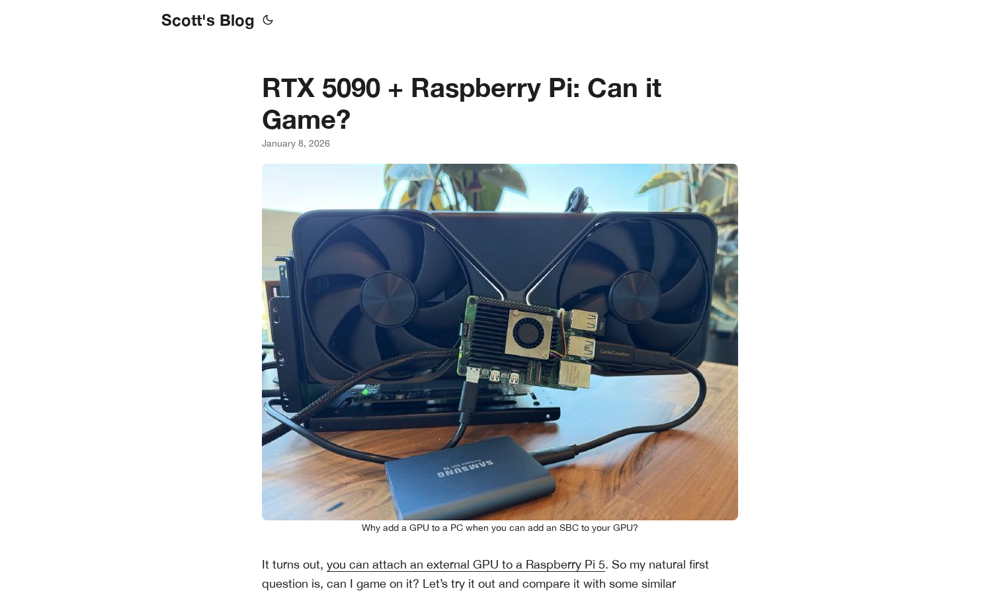
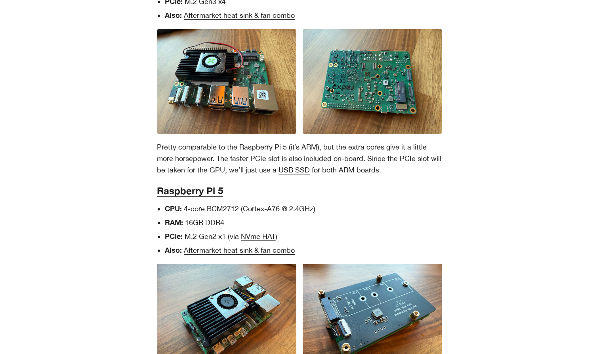
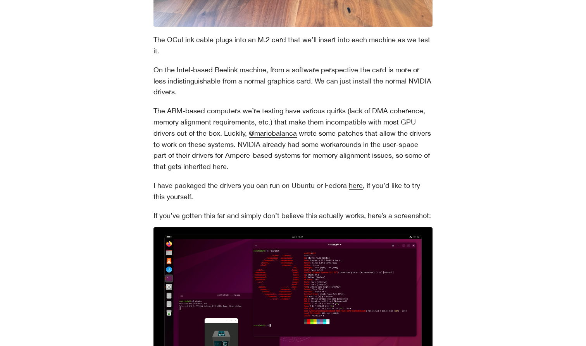

# RTX 5090 and Raspberry Pi: Can it Game?

## Overview

Scott's blog post explores an ambitious experiment: connecting an NVIDIA RTX 5090 graphics card to a Raspberry Pi to test whether gaming performance can be achieved. The article documents the setup process, hardware specifications, and the results of running games on this unusual hardware combination.

## Hardware Configuration

The post compares two setups: an Intel-based Beelink machine and ARM-based computers (Raspberry Pi 5 and another single-board computer). The key insight is that you can attach an external GPU to a Raspberry Pi through a PCIe connection, which opens up possibilities for GPU acceleration on these budget-friendly boards.

### Key Components

The author tested various GPU and SBC combinations with detailed specifications:

- **Beelink Machine**: Intel processor with RTX 5090
- **Raspberry Pi 5**: 4-core ARM CPU, 16GB DDR4, M.2 Gen2 PCIe support
- **External GPU**: RTX 5090 connected via M.2 to PCIe adapter

## Technical Challenges and Solutions

The ARM-based systems presented several challenges for GPU driver compatibility:

The author encountered memory alignment issues and DMA coherence problems on ARM systems that made them incompatible with standard GPU drivers. However, community contributions (particularly from @mariobalanca) provided patches to work around these limitations. NVIDIA has also included workarounds in their user-space drivers for Ampere-based systems.

## Practical Results

The post includes concrete evidence of the setup working, complete with terminal screenshots showing games running on the system. The author has packaged the necessary drivers for Ubuntu and Fedora, allowing others to replicate the experiment.

### Key Findings

1. **Feasibility**: GPU acceleration on ARM-based single-board computers is possible
2. **Performance**: The RTX 5090 provides significant performance improvements over integrated graphics
3. **Compatibility**: While not straightforward, driver patches have resolved most ARM compatibility issues
4. **Accessibility**: The experiment demonstrates that high-end GPU gaming may eventually be available on affordable hardware platforms

## Significance

This experiment challenges conventional wisdom about GPU compatibility on ARM systems and demonstrates the possibility of desktop-class gaming on Raspberry Pi-class devices. While the setup is unconventional, it represents an important proof of concept for GPU computing on ARM architectures.

