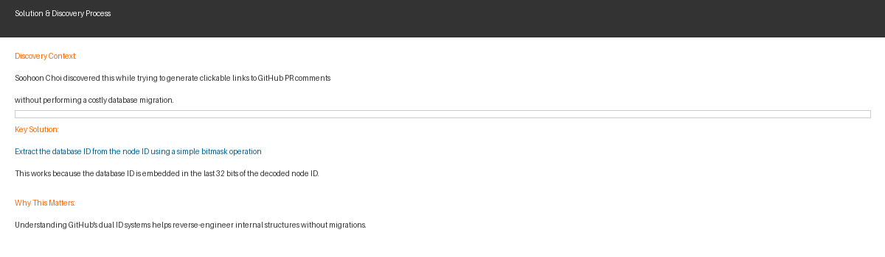

# Every GitHub object has two IDs

**By:** Soohoon Choi | **Posted on Hacker News:** Rank #2 | **Points:** 94 | **Comments:** 15

---

## Overview

GitHub maintains two separate and parallel ID systems for every object in its ecosystem. This surprising discovery reveals a fundamental architectural decision that often goes unnoticed by developers working with the platform daily. The post explores how Node IDs (used by GraphQL) and Database IDs (used by REST APIs and URLs) coexist, and demonstrates a clever technique to convert between them.

## GitHub's Dual ID Architecture

### The Two ID Systems

GitHub's dual ID system consists of:

1. **Node IDs (GraphQL):** Opaque strings that encode multiple pieces of information using MessagePack binary serialization, then base64 encoding. Example: `PRRC_kwDOL4aMSs6Tkzl8`

2. **Database IDs (REST/URLs):** Integer values directly visible in web URLs and REST API responses. Example: `2475899260`

Each system serves a different purpose and was designed at different points in GitHub's evolution. Node IDs provide a GraphQL-friendly opaque abstraction, while Database IDs remain human-readable and appear throughout the web interface.

## The Key Discovery

The brilliant insight is that **the database ID can be extracted from a node ID using a simple bitmask operation on the last 32 bits**. This means you don't need to query GitHub's database or perform expensive migrations—you can directly compute one from the other mathematically.

The Node ID encodes:
- Version identifier
- Repository database ID
- Object database ID (extractable with a 32-bit mask)

This discovery emerged from a practical problem: generating clickable links to specific GitHub PR comments without the overhead of costly database lookups or migrations.

## Why It Matters

This revelation is significant for developers and tools that need to work with GitHub's API because:

- **Efficiency:** No need for additional API calls to convert IDs
- **Legacy Support:** Understanding GitHub's evolution helps explain why the dual system exists
- **Undocumented Feature:** This mapping method isn't officially documented, making it a valuable discovery
- **Infrastructure Insight:** It demonstrates GitHub's careful consideration of backward compatibility during major infrastructure migrations

The post also touches on GitHub's legacy ID format used for older repositories, showing how the company has maintained compatibility across years of evolution while introducing new, more scalable systems.

---

**Full article:** https://www.greptile.com/blog/github-ids
**Discuss on Hacker News:** https://news.ycombinator.com/item?id=46602591
