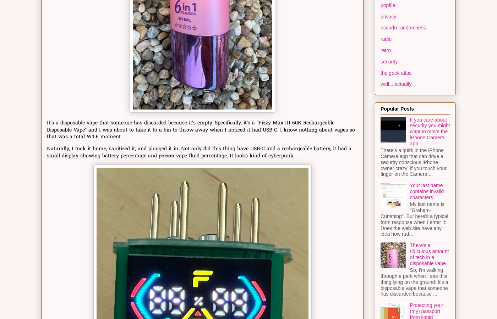
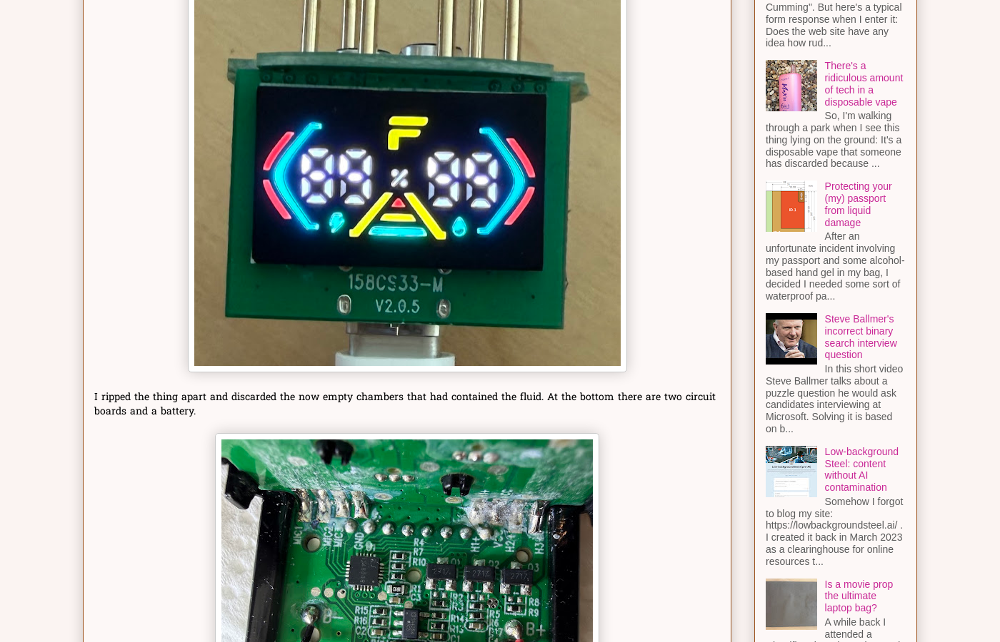

# There's a Ridiculous Amount of Tech in a Disposable Vape

## Article Overview

John Graham-Cumming stumbled upon an abandoned disposable vape in a park and was immediately intrigued to discover it featured USB-C connectivity. Rather than simply discarding it, he brought it home, cleaned it, and found it to be loaded with surprising technology: a rechargeable 800 mAh lithium polymer battery, a display showing battery and fluid levels, and sophisticated electronics for controlling multiple flavor chambers. This discovery of advanced technology in a supposedly "disposable" device raises questions about electronic waste and the engineering that goes into single-use products.

## The Technical Discovery

The vape's internals revealed two circuit boards and a custom lithium battery. What makes this particularly interesting is that the device uses microphones as input sensors—specifically three pairs of microphones strategically positioned to detect when the user is drawing from any of six different positions on the device. By analyzing which combination of microphones sense the suction, the device can activate one or two of three heating elements, providing six distinct flavor combinations. The circuit boards contain transistors controlling the heating elements, a charging circuit for the USB-C port, and a microprocessor (labeled B0081S1) that orchestrates all these functions. Despite identifying what appear to be debugging pads connected to the microprocessor and USB-C connector, Graham-Cumming was unable to establish communication with the device using standard tools like PyOCD.

## Environmental and Design Implications

The most striking aspect of this discovery is the disconnect between the device's "disposable" marketing and its actual technological sophistication. An 800 mAh battery, microprocessor, multiple sensors, heating circuits, and a display represent a substantial amount of electronic waste when the device is discarded after 60,000 puffs. While manufacturers intend for such devices to be recycled, the reality of single-use electronics combined with complex components makes this an expensive and resource-intensive design decision. The article highlights an interesting engineering paradox: a device designed for casual consumption contains the kinds of sophisticated electronics typically reserved for consumer gadgets meant to last years.

---

## Screenshots

### Main Article Content and Title

### Key Visual Elements - Vape Disassembly and Technical Details

### Technical Components and Microphone Positioning Details

---

**Published:** January 8, 2026
**Blog:** John Graham-Cumming's Blog
**Tags:** hardware, pseudo-randomness
