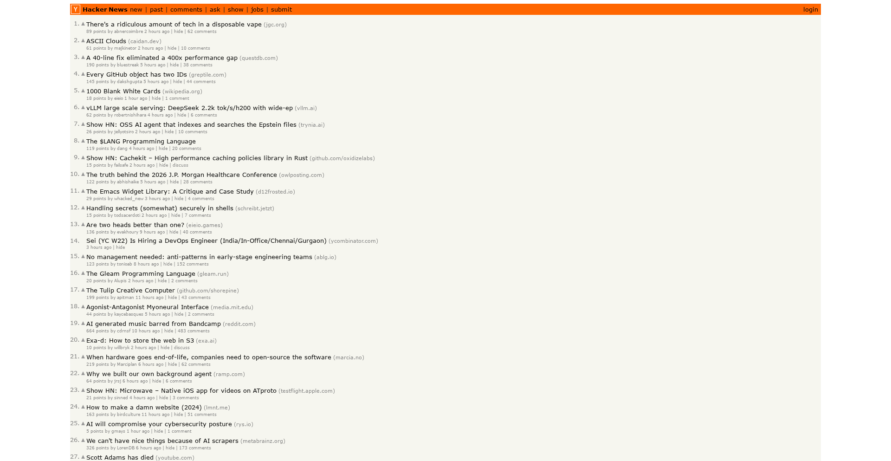
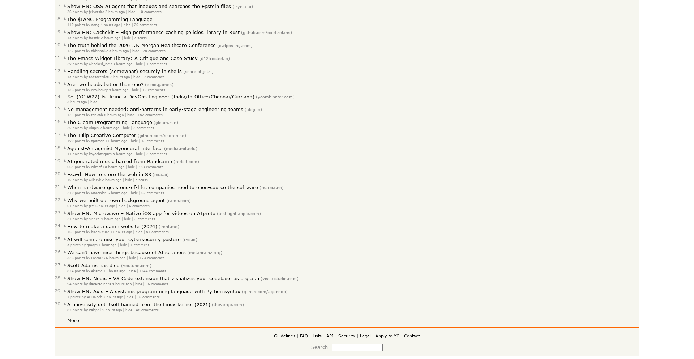
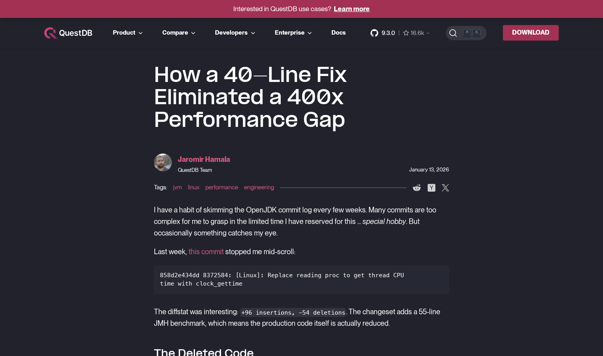

# A 40-Line Fix Eliminated a 400x Performance Gap

## Overview

This post discusses a remarkable OpenJDK performance optimization that dramatically improved thread CPU time measurement on Linux systems. Through a simple 40-line fix, developers achieved a **30x-400x performance improvement**, reducing latency from approximately 11 microseconds to just 279 nanoseconds per operation.

## The Problem

The `ThreadMXBean.getCurrentThreadUserTime()` method suffered from significant performance issues due to its implementation approach. The original code relied on reading `/proc/self/task/<tid>/stat` files, which involved:

- Multiple system calls
- Virtual File System (VFS) operations
- Complex string parsing
- Significant overhead on high-concurrency systems

When application performance monitoring or profiling required frequent thread CPU time measurements, this implementation became a serious bottleneck.

## The Solution

The breakthrough came through an elegant use of Linux kernel ABI details. Instead of parsing filesystem data, the new implementation uses a direct `clock_gettime()` syscall with a clever bit-manipulation trick:

By flipping specific bits in the `clockid_t` value, the kernel can provide user-time-only metrics instead of total CPU time. This single-syscall approach eliminated multiple layers of overhead.

## Impact and Results

The performance improvements were exceptional:

- **Best case**: 40x latency reduction in benchmarks
- **Real-world range**: 30x-400x improvement depending on system load and concurrency
- **Absolute numbers**: Latency dropped from ~11 microseconds to ~279 nanoseconds per operation
- **Code change**: Only ~40 lines of code modified

The fix successfully removed complexity while dramatically improving performance, making thread CPU time measurement practical for real-world applications requiring frequent profiling.

## Availability

This optimization became available in **JDK 26**, releasing in March 2026, bringing significant performance benefits to Java applications that rely on thread CPU time measurement for monitoring and profiling operations.

The post exemplifies how deep understanding of operating system internals and kernel APIs can lead to elegant, high-impact optimizations that improve both performance and code simplicity.
