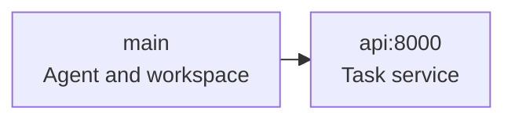

The agent works in a service called `main`. Other containers provide the services it needs. All belong to one trial.



## Add a small HTTP service

This environment gives the agent a JSON file through an HTTP service. Add it to a task with an [instruction and verifier](/core-concepts/tasks).

<FileTree>

- my-task/
  - instruction.md
  - task.toml
  - environment/
    - Dockerfile
    - docker-compose.yaml
    - api/
      - Dockerfile
      - status.json
  - tests/
    - test.sh

</FileTree>

<CodeGroup>
```dockerfile environment/Dockerfile
FROM python:3.12-slim
WORKDIR /app
```

```dockerfile environment/api/Dockerfile
FROM python:3.12-slim
WORKDIR /srv
COPY status.json .
CMD ["python3", "-m", "http.server", "8000", "--bind", "0.0.0.0"]
```

```json environment/api/status.json
{"status": "ready", "items": 3}
```
</CodeGroup>

Name the Compose file exactly `environment/docker-compose.yaml`:

```yaml environment/docker-compose.yaml
services:
  main:
    depends_on:
      api:
        condition: service_healthy
  api:
    build:
      context: ./api
    healthcheck:
      test:
        - CMD
        - python3
        - -c
        - >-
          import urllib.request;
          urllib.request.urlopen(
            'http://localhost:8000/status.json'
          )
      interval: 2s
      timeout: 5s
      retries: 15
```

Evolve builds `main` from `environment/Dockerfile` and `api` from its own Dockerfile. `depends_on` waits for the API healthcheck. From `main`, the agent can read `http://api:8000/status.json` using the service name as the hostname.

The `main` stanza above only adds a dependency. You can omit it when you have no overrides. To use a prebuilt main image, set `[environment].docker_image` in `task.toml`.

## Images, files, and configuration

| Choice | Rule |
| --- | --- |
| Service `image` | Use a public image with an explicit tag or digest |
| Service `build` | Keep the context inside the task directory and the Dockerfile inside that context |
| Build options | `context`, `dockerfile`, `args`, `target`, `no_cache`, `pull`, and `labels` |
| Service dependencies | Use Compose `depends_on` and healthchecks |
| Container files | Include bind-mounted source files inside the task's `environment/` directory |
| Runtime configuration | Compose ports, volumes, networks, `environment`, and `env_file` are handled by Compose |

Images are resolved during dataset import. Runtime tasks use the recorded images. Task files and image-build inputs are not a secret store; use [job secrets](/core-concepts/secrets) for agent credentials.

<Accordion title="Configuration that import rejects">
  - `include` and service `extends`, which can introduce unseen service images.
  - Interpolated image names, untagged images, and an unpinned `:latest` tag.
  - Build options such as `ssh`, `secrets`, additional contexts, and inline Dockerfiles.
  - A build context outside the task, or a Dockerfile outside its build context.
  - `main.build` together with `[environment].docker_image`, or conflicting main image declarations.
</Accordion>

## Provider and task limits

Compose tasks run on **E2B or Daytona**. They do not support Modal, `no-network`, GPUs, or multi-step execution. [Sandbox capabilities](/core-concepts/sandboxes) describes provider selection and other network restrictions.

## Score service state

A verifier may need more than files from `main`: a request log, a database export, or an in-memory counter. Use [collection hooks and service artifacts](/core-concepts/task-verifiers#collect-from-a-service) to save that evidence before verification.
