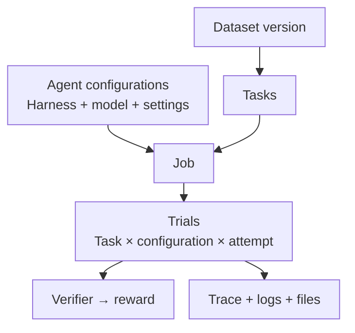

A dataset supplies the tasks. An agent and model attempt them. A verifier scores the work.

| Concept | What it means | Example |
| --- | --- | --- |
| [Task](/core-concepts/tasks) | An instruction, environment, and grading logic. | Fix a bug and pass the tests. |
| [Dataset](/core-concepts/datasets) | A named, versioned collection of tasks. | `harbor-examples@1.0`. |
| [Agent](/core-concepts/agents) | A harness running a selected model. | Codex with `gpt-5.6-luna`. |
| [Sandbox](/core-concepts/sandboxes) | The isolated environment where a trial runs. | A task image on Daytona, E2B, or Modal. |
| [Job](/core-concepts/jobs) | A group of trials with shared run settings. | 10 tasks × 2 configurations × 3 attempts = 60 trials. |
| [Trial](/core-concepts/trials) | One attempt at one task. | One score and its supporting evidence. |
| [Verifier](/core-concepts/task-verifiers) | The task's code that evaluates the output. | A script writing a reward of `0` or `1`. |
| [Trace](/core-concepts/trial-outputs) | The recorded agent conversation and actions. | Messages, tool calls, and results. |

## Two ways to examine quality

<CardGroup cols={2}>
  <Card title="Check the task" icon="list-checks" href="/core-concepts/check">
    Review the instruction, environment, solution, and verifier before scaling the evaluation.
  </Card>
  <Card title="Analyze the attempt" icon="search" href="/core-concepts/analyze">
    Review a recorded trial against a rubric to understand the agent's behavior.
  </Card>
</CardGroup>

Checks and analyses are optional model-powered operations with their own results and costs. The task's verifier produces the evaluation reward.

## Read the result at the right level

| Level | What to read |
| --- | --- |
| **Job configuration** | What was selected and resolved |
| **Job summary** | Counts, scores, and costs |
| **Each trial: status** | Whether execution and grading completed |
| **Each trial: reward** | How the verifier scored the work |
| **Each trial: evidence** | Trace, logs, and recorded files |

Start with the [quick start](/getting-started/quick-start), then learn how to [configure a job](/core-concepts/jobs).
