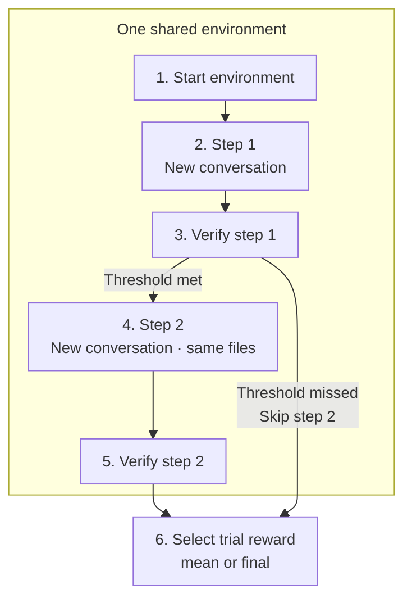

A multi-step task runs ordered instructions in one shared environment. Files persist between steps; each step starts a fresh agent conversation and receives its own verification result.



This two-step example uses the same environment for both agent steps and their verifiers. Reward thresholds and failure rules decide whether later steps run.

## Directory layout

<FileTree>

- migrate-then-test/
  - task.toml
  - environment/
    - Dockerfile
  - tests/
    - test.sh
  - steps/
    - 01-migrate/
      - instruction.md
      - tests/
        - test.sh
      - workdir/
        - setup.sh
    - 02-test/
      - instruction.md
      - tests/
        - test.sh

</FileTree>

The root `tests/` folder can hold shared verifier files. Each step can include optional `workdir/` files and a `setup.sh` inside that folder.

Each step needs an instruction and a test script, either its own or the shared root `tests/test.sh`. Step test files override shared files with the same path.

## Declare the order

```toml task.toml
multi_step_reward_strategy = "mean"

[[steps]]
name = "01-migrate"
min_reward = 0.5

[[steps]]
name = "02-test"

[steps.agent]
timeout_sec = 600
```

Every declared step must have a matching directory, and every step directory must be declared. There is no root instruction for this layout.

Before a step starts, its optional `workdir/` files are copied into the working directory and `setup.sh` runs if present.

## Rewards and stopping

| Setting | Meaning |
| --- | --- |
| `mean` | Average each metric across steps with a verifier result; a missing metric counts as `0`. This is the default |
| `final` | Use the last executed step's result, including a step that stopped the trial early |
| `min_reward = 0.5` | Require the `reward` key to be at least `0.5`; a missing key also stops the trial |
| `min_reward = { accuracy = 0.8 }` | Require each named metric to meet its threshold; a missing metric also stops the trial |

A setup or healthcheck failure stops the remaining steps. A step error with no verifier result also stops the trial. An agent error alone can still continue when verification returns a result and the reward thresholds pass. Infrastructure failures stop the trial.

The trial exposes individual outcomes in `step_results`. A retry starts again at step 1.

## Current limits

| Supported per step | Set once for the whole task |
| --- | --- |
| Instruction and tests | Environment image and agent user |
| Agent and verifier timeouts | Network policies |
| Verifier environment variables | Shared verifier mode |
| Healthcheck | Sandbox provider |

Multi-step tasks require shared verification. Compose, separate verification, per-step agent users, per-step network policies, per-step verifier environments, and per-step collection hooks are rejected. Verifiers run as root. These trials cannot be regraded.

`steps.artifacts` does not create a separate snapshot after each step. Save intermediate outputs under distinct paths when you need to inspect them later.

To seed the first conversation on Claude Code or Codex, put an ATIF `trajectory.json` inside the first step’s directory, beside its `instruction.md`. A root trajectory or a trajectory in a later step is rejected. Later steps start fresh conversations.
