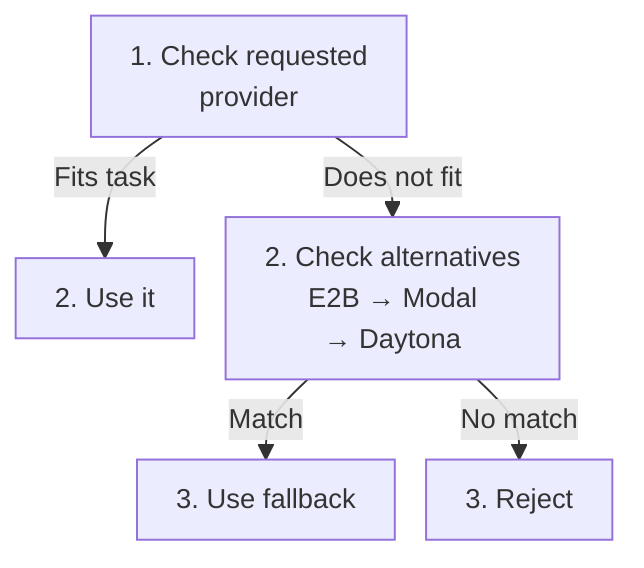

Each trial runs in its own cloud sandbox. Use `-e` to request E2B, Daytona, or Modal; the default is Daytona.

```bash
evolve run -d harbor-examples@1.0 -i hello-world \
  -a codex -m gpt-6-luna -e modal \
  --max-trial-spend 1 --max-retries 0 --watch
```

## Task requirements come first

Evolve checks the requested provider against the task's image, resources, network policy, Compose services, and GPUs.



A fallback is recorded as `sandbox_provider_degrade` on the trial. The requested provider on the job and the actual provider on a trial can differ.

If no provider can satisfy the task, Evolve rejects the configuration.

```bash
evolve dataset show harbor-examples@1.0
```

Inspect the per-task provider verdicts before starting a larger run. A compatible declaration does not guarantee immediate provider capacity.

## Supported configurations

| Capability | E2B | Daytona | Modal |
| --- | --- | --- | --- |
| Single-container tasks | Yes | Yes | Yes |
| Docker Compose | Yes | Yes | No |
| GPUs | No | Subject to live quota and GPU type | Yes |
| Compose with GPUs | No | No | No |
| Compose with `no-network` | No | No | No |

Network allowlist kinds and resource ceilings also differ. The live [`meta()` document](/sdk-reference/meta) publishes these constraints. Daytona disk and GPU limits depend on the platform's live provider quota.

<Note>
  A temporary capacity shortage can put a trial back in the queue even with `--max-retries 0`. Capacity waits are bounded and separate from ordinary retry attempts.
</Note>

## Your own provider account

Add `--own-infra` to run every sandbox of a job in your own E2B, Daytona, or Modal account instead of Evolve's. The provider's own variables are read from your shell, the same ones Harbor's `-e <provider>` uses:

| Provider | Variables |
| --- | --- |
| E2B | `E2B_API_KEY` |
| Daytona | `DAYTONA_API_KEY`, plus optional `DAYTONA_API_URL` and `DAYTONA_TARGET` |
| Modal | `MODAL_TOKEN_ID` and `MODAL_TOKEN_SECRET`, or the active profile in `~/.modal.toml` |

```bash
export MODAL_TOKEN_ID=ak-... MODAL_TOKEN_SECRET=as-...
evolve run -d harbor-examples@1.0 -a codex -m gpt-6-luna -e modal --own-infra --watch
```

The keys are saved as ordinary [secrets](/core-concepts/secrets) on first use. A variable that is not set in your shell is taken from your stored secret of the same name, so `evolve secrets set E2B_API_KEY --delivery direct` once is enough. `evolve secrets delete` removes a key; a job whose key is gone fails its next trial instead of running on Evolve's account. The keys never enter a sandbox. If your shell holds a different value than the stored one, the run is refused: delete the stored key, or unset the variable to use it.

The job reads back with `sandbox_account: own`. Because you can reach those sandboxes through your provider, including the hidden tests and the reward file, scores from your own account are yours to vouch for.

An own-account job:

- boots public images only. Every public dataset qualifies; private datasets' images live on Evolve's private registry.
- runs no Docker Compose task and no Daytona GPU task.
- never moves a task to another provider. A task the requested provider cannot serve is rejected at creation with `provider_unsupported`.
- does not count against Evolve's per-provider sandbox ceilings or GPU cap. The job's `-n` concurrency still applies, and your provider's own limits apply as capacity waits.

Analysis, checks, and regrades of its trials still run on Evolve's account. In the SDK, pass `sandbox_credentials` to `jobs().start()`.

## Images and startup

Dataset publication prepares task images. A provider may also need to prepare its own cached image or snapshot before the first trial. That first start can take longer than later trials using the cache.

Resources come from the task's `task.toml`. See [task configuration](/core-concepts/task-config) for defaults and how to request CPUs, memory, disk, and GPUs.

## GPU costs

GPU compute is shown as an estimate, separate from model spend:

| Location | Field |
| --- | --- |
| Trial | `gpu_cost` |
| Job totals | `stats.gpu_cost_usd` |
| CLI trial view | `gpu compute (est.)` |

An unavailable estimate includes `unpriced_reason`. Do not add this estimate to the metered model cost and present it as the same charge.

## Analysis and checks

These operations also use sandboxes. Choose their provider with `-e` on `evolve analyze` or `evolve check`, or `--analyze-provider` for analysis attached to a run. Their default is Daytona unless the platform operator configures another provider; the [SDK defaults](/sdk-reference/analyses#read-current-defaults) expose the resolved setting.
