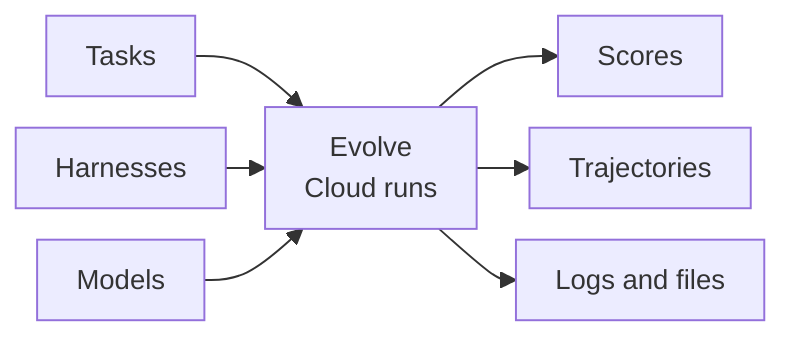

Evolve is the engine for running reproducible agent evaluations at scale across tasks, sandboxes, harnesses, and models. It provides quality control during task creation, with full observability and trajectory analysis for every run.



<CardGroup cols={2}>
  <Card title="Task quality checks" icon="list-check" href="/core-concepts/check">
    Check that tasks are solvable, instructions are clear, and verifiers score correctly.
  </Card>
  <Card title="Agent optimization" icon="git-compare" href="/core-concepts/jobs">
    Compare harnesses, models, and settings on the same tasks. Measure rewards and costs.
  </Card>
  <Card title="Trajectory analysis" icon="search" href="/core-concepts/analyze">
    Review the agent’s actions, failures, and the evidence behind its score.
  </Card>
  <Card title="Full observability" icon="activity" href="/core-concepts/trial-outputs">
    Inspect traces, files, verifier logs, timing, token usage, and costs.
  </Card>
</CardGroup>

## One command to start

After [installation and authentication](/getting-started/installation), run one task:

```bash
evolve run \
  -d harbor-examples@1.0 -i hello-world \
  -a codex -m gpt-5.6-luna \
  --max-trial-spend 1 --max-retries 0 --watch
```

The job runs on Evolve. Your terminal follows its progress; closing the terminal does not cancel it.

<CardGroup cols={3}>
  <Card title="First evaluation" icon="play" href="/getting-started/quick-start">
    Run, score, and inspect one task.
  </Card>
  <Card title="Your own tasks" icon="folder-plus" href="/core-concepts/tasks">
    Build in the Harbor task format.
  </Card>
  <Card title="Python and TypeScript" icon="code" href="/sdk-reference/index">
    Run evaluations from code.
  </Card>
</CardGroup>
