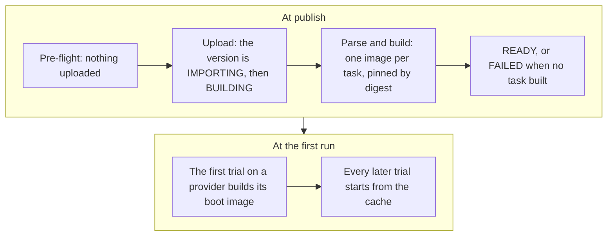

A dataset is a named, versioned folder of [tasks](/core-concepts/tasks) in the catalog. You name a version as `name@version`. A bare name means the dataset's active version.

## Browse the catalog

```bash
evolve dataset list
evolve dataset show terminal-bench-4@4.0
```

`dataset list` prints every dataset you can run: the platform's public datasets and your own. `--search <text>` filters by name and description. `dataset show` prints one dataset's versions, its tasks with their timeouts, and for each task which sandbox providers can run it.

## Publish your own

Any folder of task directories can be published: a single task directory, a directory with a `tasks/` folder, or a directory of task directories. What you publish is private to your organization; another account asking for its name reads `dataset_not_found`. A name belongs to its first publisher: re-publishing your own name adds a version, and a name owned by anyone else is refused with `dataset_name_taken`.

Check it first: the pre-flight is a dry run that uploads nothing and writes nothing.

```bash
evolve dataset check ./my-swe
```

Then publish from a local directory, from a git repository, or from a source the server fetches itself.

<Tabs>
  <Tab title="Local directory">
    ```bash
    evolve dataset publish \
      --dir ./my-swe \
      --name my-swe \
      --version 1.0 \
      --watch
    ```

    When the folder carries a `dataset.toml` manifest, `--name` and `--version` come from it and may be omitted.

    Everything in the directory is packed, dotfiles included; only `.git`, `.DS_Store` and `.venv` are left out, and symlinks are never packed. An archive over 256 MiB resumes after a dropped connection instead of restarting, and its import is visible, as `QUEUED (receiving)`, while it uploads.
  </Tab>
  <Tab title="Git repository">
    ```bash
    evolve dataset publish \
      --git https://github.com/acme/my-swe.git \
      --ref v1.0.0 \
      --name my-swe \
      --version 1.0 \
      --watch
    ```

    `--ref` must be pinned: a tag, or a full 40-character commit sha. A branch name is refused with `unpinned_git_ref`, and the refusal's `details.commit` is the sha to pin. `--path <subfolder>` imports one folder of a larger repository. The URL must be `https://`; for a private repository put a token in it.
  </Tab>
  <Tab title="Fetchable source">
    ```bash
    evolve dataset publish --from hub:cookbook/hello-world --watch
    ```

    `--from` takes a public https tarball URL, or `hub:org/name[@ref]` for a public package on the Harbor hub. Both are public only, with no credentials in the URL. A tarball may wrap the corpus in one top-level directory, so a repository's archive URL publishes as is.

    For a hub package the name and version default to the package's own, and the ref is pinned when the publish is accepted. A package the hub does not show is refused with `hub_package_not_found`; a hub that cannot be reached is `hub_unreachable`, retry the publish.
  </Tab>
</Tabs>

`--watch` follows the publish until the version is READY or FAILED. Each task builds on its own, so one broken task does not block the others; `--watch` ends with how many built. If the terminal is gone, `evolve dataset watch <name>` re-attaches to the same follow, from any machine. `--skip-preflight` uploads without the check; a task the check would have refused then fails at import instead.

### The pre-flight

The pre-flight sends each task's `task.toml`, and the `dataset.toml` if there is one, and answers with a verdict per task. It checks what a `task.toml` alone can decide, so an all-ok answer means no config refuses, not that every image will build. A `NOTE` is not a refusal; today it is `tests_dockerfile_not_built`. A refused task stops the publish before anything is uploaded.

### The manifest

A corpus with a `dataset.toml` imports what the manifest says: only the tasks listed under `[[tasks]]`, each verified against its pinned digest. A listed task the checkout lacks fails the publish with `manifest_task_missing`, a digest mismatch with `manifest_digest_mismatch`. The `[dataset]` description reaches the catalog, and every version records the identity it imported under as `manifest`. A `metric.py` custom metric is refused with `custom_metric_not_supported`.

## What happens when you publish



The new version is recorded as IMPORTING, then BUILDING while the task images build. Every declaration in a `task.toml` is honored or refused with the reason; a task never runs on weaker semantics than it declares. Tasks build independently: one that fails is recorded FAILED with a typed reason, and the others keep building.

The version lands READY when at least one task built, and FAILED only when none did or on a corpus-level refusal; a FAILED version changes nothing, the dataset keeps serving what it served. On your own dataset, READY also makes the version active, so the bare name runs it. A job refuses any version that is not READY with `version_not_ready`.

Nothing is built for a sandbox provider at publish. The first trial of a task on a provider takes one to three minutes longer while that provider's image is prepared; every later trial starts from the cache.

The import's `warnings` name what a version will permanently lack: `no_solutions_archived` or `partial_solutions_archived` for the reference-solution record, `tasks_failed_to_build` when some tasks failed, `tests_dockerfile_not_built` for the tasks whose verifier never builds their `tests/Dockerfile`.

### Partially built versions

On the version, `task_count` counts the READY tasks and `n_failed_tasks` the rest. `dataset show name@version` lists every failed task with its reason, and `dataset publish --watch` prints each task's outcome. A whole-dataset or glob job on such a version runs the READY tasks and says so in its `build_exclusions`. Naming a failed task explicitly at job create is refused with `task_failed_to_build`; a fix is a new version.

### Version states

A version moves `DRAFT` → `RECEIVING` (a large upload still streaming) → `IMPORTING` → `BUILDING` → `READY`, with `FAILED` and `ARCHIVED` as off-ramps. `READY` is the only state that accepts jobs.

An import is `QUEUED` (`receiving: true` while the corpus is still uploading), `RUNNING`, `COMPLETED` (the version is READY) or `FAILED` (read `failure`). A finished import stays readable as long as its dataset exists.

## Versions

Each publish creates a version, and a version that lands READY is built and active. To point the bare name at a different READY version:

```bash
evolve dataset activate my-swe 1.0
```

Activating the version that is already active succeeds without change. A version still building is refused with `version_not_ready`; a FAILED or ARCHIVED one with `version_not_activatable`.

The owner of a dataset can download the original package back:

```bash
evolve dataset download my-swe@1.0 -o corpora/
```

It is the whole corpus you published, `solution/` included, and the one call that returns task files. Only the owner may: a platform dataset has no owner and cannot be downloaded, and someone else's dataset reads as not found.

Deleting a dataset takes its versions, tasks and archived solutions with it. You must own it (`dataset_not_owned` on a platform dataset), and a dataset any job ran against is never deleted: `dataset_in_use` names the blocking jobs, and deleting those first is the only way through.

A dataset published from git records what it was built from, and `dataset list` and `dataset show` print one line when the ref has moved upstream. A new version is always one you publish, unless you opt in with `datasets().update(name, { upstream_auto_import: true })`; that is refused with `upstream_not_watchable` on a dataset with no moving git ref.

<Card title="dataset reference" icon="terminal" href="/cli-reference/dataset">
  Every flag of `evolve dataset`.
</Card>
