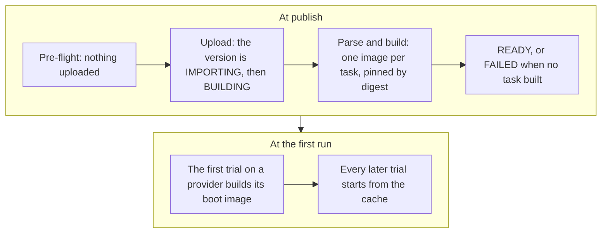

A dataset is a named, versioned folder of [tasks](/core-concepts/tasks) in the catalog. You name a version as `name@version`. A bare name means the dataset's active version.

## Browse the catalog

```bash
evolve dataset list
evolve dataset show terminal-bench-4@4.0
```

`dataset list` prints every dataset you can run: the platform's public datasets and your own. `--search <text>` filters by name and description. `dataset show` prints one dataset's versions, its tasks with their timeouts, and for each task which sandbox providers can run it.

## Publish your own

Any folder of task directories can be published: a directory whose `tasks/` holds one directory per task, or the tasks directory itself. What you publish is private to your organization: it never appears in anyone else's catalog, and another account asking for its name reads `dataset_not_found`. A name belongs to its first publisher; re-publishing your own name adds a version, and a name owned by anyone else is refused with `dataset_name_taken`.

Check it first: the pre-flight is a dry run that uploads nothing and writes nothing.

```bash
evolve dataset check ./my-swe
```

Then publish from a local directory, from a git repository, or from a source the server fetches itself.

<Tabs>
  <Tab title="Local directory">
    ```bash
    evolve dataset publish \
      --dir ./my-swe \
      --name my-swe \
      --version 1.0 \
      --watch
    ```

    When the folder carries a `dataset.toml` manifest, `--name` and `--version` come from it and may be omitted.

    Everything in the directory is packed, dotfiles included, and executables stay executable. Only `.git`, `.DS_Store` and `.venv` are left out, and symlinks are never packed. The same directory always produces the same bytes, so the tarball's sha256 is the version's source identity. An archive over 256 MiB rides a resumable upload in 6 MiB verified chunks, so a dropped connection resumes from the last acknowledged chunk; a 429 or 503 mid-transfer is waited out, at most 60 s per wait and three waits per request. Such a publish registers its import the moment the session opens, before any byte moves, so it is watchable while it uploads: the import reads `QUEUED` with `receiving: true` until the corpus has arrived. Nothing is registered early when the manifest supplies the name and version, or when that version label already exists; an abandoned upload removes its import.
  </Tab>
  <Tab title="Git repository">
    ```bash
    evolve dataset publish \
      --git https://github.com/acme/my-swe.git \
      --ref v1.0.0 \
      --name my-swe \
      --version 1.0 \
      --watch
    ```

    `--ref` must be pinned: a tag, or a full 40-character commit sha. A tag is resolved to its commit when the publish is accepted and verified at import. A branch name is refused with `unpinned_git_ref`, and the refusal's `details.commit` is the sha to pin. `--path <subfolder>` imports one folder of a larger repository, through a sparse checkout. The URL must be `https://`; for a private repository put a token in it. A git publish always needs `--name` and `--version`.
  </Tab>
  <Tab title="Fetchable source">
    ```bash
    evolve dataset publish --from hub:cookbook/hello-world --watch
    ```

    `--from` takes a public https tarball URL, or `hub:org/name[@ref]` for a public package on the Harbor hub. Both are public only: no credentials in the URL, and a corpus whose declared size is over the cap is refused before the download. A tarball may wrap the corpus in one top-level directory, so a repository's archive URL publishes as is. For a hub package the name and version default to the package's own; the ref is resolved when the publish is accepted and the digest is what the platform fetches by, so a tag moved later can never deliver different bytes. A task package imports as a one-task dataset, a dataset package fetches every member. A package the hub does not show is refused with `hub_package_not_found`; a hub that cannot be reached is `hub_unreachable`, retry the publish.
  </Tab>
</Tabs>

`--watch` follows the publish until the version is READY or FAILED. Each task builds on its own, so one broken task does not block the others; `--watch` ends with how many built. If the terminal is gone, `evolve dataset watch <name>` re-attaches to the same follow, from any machine. `--skip-preflight` uploads without the check; a task the check would have refused then fails at import instead.

### The pre-flight

The pre-flight sends each task's `task.toml`, and the `dataset.toml` if there is one, to the server, which answers with a verdict per task and writes nothing. The answer names what it checked and what it deferred: a `task.toml` alone cannot prove the Dockerfile, the compose file or the tests tree, so an all-ok pre-flight means nothing decidable from the configs refuses, not that the build will succeed. A `NOTE` is not a refusal; today it is `tests_dockerfile_not_built`, and the same note lands on the task once published. A refused task stops the publish before anything is uploaded.

### The manifest

A corpus with a `dataset.toml` imports what the manifest says. Only the tasks it lists under `[[tasks]]` are imported; a listed task the checkout lacks fails the publish with `manifest_task_missing`. Every pinned `sha256:` digest is recomputed and a mismatch fails the publish with `manifest_digest_mismatch`, naming each divergent task. The `[dataset]` description reaches the catalog and every version records the identity it imported under as `manifest`. A `metric.py` custom metric is refused with `custom_metric_not_supported`.

## What happens when you publish



The upload is stored on the server, the new version is recorded as IMPORTING, then BUILDING while the task images build, and the dataset is stamped as yours.

The importer reads every task directory: first the shape of its `task.toml`, against a strict schema, then its meaning. Every declaration is honored or refused with the reason; a task never runs on weaker semantics than it declares.

Each task's `environment/` is built into an image, pushed to the platform's registry and pinned by its digest. Tasks build independently: one that fails any step is recorded FAILED with a typed reason, and the others keep building.

The version lands READY when at least one task built, and FAILED only when none did (`all_tasks_failed_to_build`) or on a corpus-level refusal; a FAILED version changes nothing, the dataset keeps serving what it served. On your own dataset, READY also makes the version active, so the bare name runs it. A job refuses any version that is not READY with `version_not_ready`.

Nothing is built for any sandbox provider at publish. The first trial of a task on a provider builds that provider's boot image from the task image, once, and every later trial on that provider starts from the cache. That first trial takes one to three minutes longer; it is the provider build, not a hang.

The import's `warnings` say what a version will permanently lack: `no_solutions_archived`, `partial_solutions_archived` or `solutions_archiving_disabled` for the reference-solution record, which gates nothing; `tasks_failed_to_build` when some tasks failed; `tests_dockerfile_not_built` for the tasks whose verifier never builds their `tests/Dockerfile`.

### Partially built versions

On the version, `task_count` counts the READY tasks and `n_failed_tasks` the rest. `dataset show name@version` lists every failed task with its typed reason (`code`, `step`, `message`), and `dataset publish --watch` prints each task's outcome once the build settles. A whole-dataset or glob job on such a version runs the READY tasks and says so in its `build_exclusions`: one entry per affected dataset with a sentence, the counts and the failed names. Naming a failed task explicitly at job create is refused with `task_failed_to_build`, quoting the build failure. Versions are immutable, so a fix is a new version.

### Version states

A version moves `DRAFT` → `RECEIVING` (a large upload still streaming) → `IMPORTING` → `BUILDING` → `READY`, with `FAILED` and `ARCHIVED` as off-ramps. `READY` is the only state that accepts jobs. A platform-curated dataset has no owner, so its versions land READY but wait for an operator to activate them.

An import is `QUEUED` (`receiving: true` while the corpus is still uploading), `RUNNING`, `COMPLETED` (the version is READY) or `FAILED` (read `failure`). A terminal import stays readable as long as its dataset exists; only a receiving import whose upload was abandoned is removed.

## Versions

Each publish creates a version, and a version that lands READY is built and active. To point the bare name at a different READY version:

```bash
evolve dataset activate my-swe 1.0
```

Activating the version that is already active succeeds without change. A version still building is refused with `version_not_ready`; a FAILED or ARCHIVED one with `version_not_activatable`.

The owner of a dataset can download the original package back:

```bash
evolve dataset download my-swe@1.0 -o corpora/
```

It is the whole corpus you published, `solution/` included, and the one call that returns task files. Ownership is the only door: a platform dataset has no owner and cannot be downloaded by anyone, and someone else's dataset reads as not found.

Deleting a dataset takes its versions, tasks and archived solutions with it; mirrored images stay, because other datasets may pin them. You must own it (`dataset_not_owned` on a platform dataset). A dataset any job ran against is never deleted: `dataset_in_use` names the blocking jobs, and deleting those first is the only way through.

A dataset published from git records what it was built from, and the platform periodically checks where the ref points now; the answer is the dataset's `upstream`. `dataset list` and `dataset show` print one line for a dataset whose ref has moved. Watching produces a fact, not an action: a new version is always one you publish, unless you opt in with `datasets().update(name, { upstream_auto_import: true })`, which is refused with `upstream_not_watchable` on a dataset with no moving git ref.

<Card title="dataset reference" icon="terminal" href="/cli-reference/dataset">
  Every flag of `evolve dataset`.
</Card>
