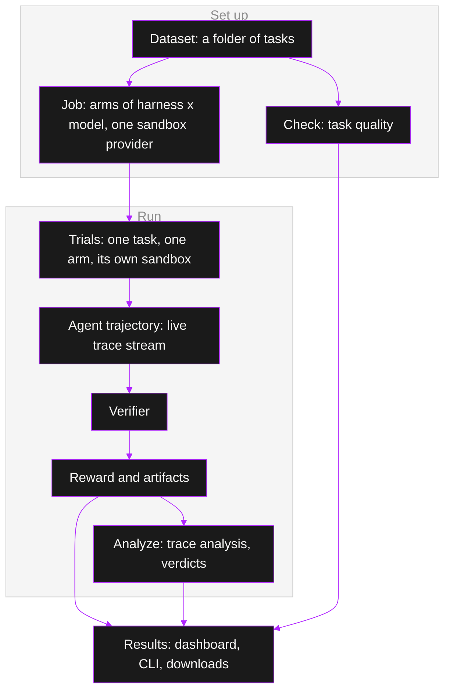

- **Dataset**: a named, versioned folder of tasks in the catalog. `name@version` names one version; a bare name means the active one.
- **Task**: one directory with an instruction, an environment, and a verifier. See [tasks](/core-concepts/tasks).
- **Job**: one run of every task of its datasets by every arm, a fixed number of attempts each. See [jobs](/core-concepts/jobs).
- **Arm**: one harness driving one model, with its optional effort, preset, config and skills. A job with two models has two arms, and every arm runs on the job's one sandbox provider.
- **Trial**: one attempt of one task by one arm, in its own sandbox. See [trials](/core-concepts/trials).
- **Trajectory**: the trial's recorded trace, streamed live while it runs: the instruction, every agent turn, every tool call and its result.
- **Verifier**: the task's test script. It runs after the agent and produces the reward.
- **Reward**: the verifier's score for the trial, usually `1` or `0`.
- **Analysis**: a rubric judgment of a settled trial's trace, one analyzer run per trial. See [analyze](/core-concepts/analyze).
- **Check**: a rubric judgment of a task itself, before you spend a job on it. See [check](/core-concepts/check).
