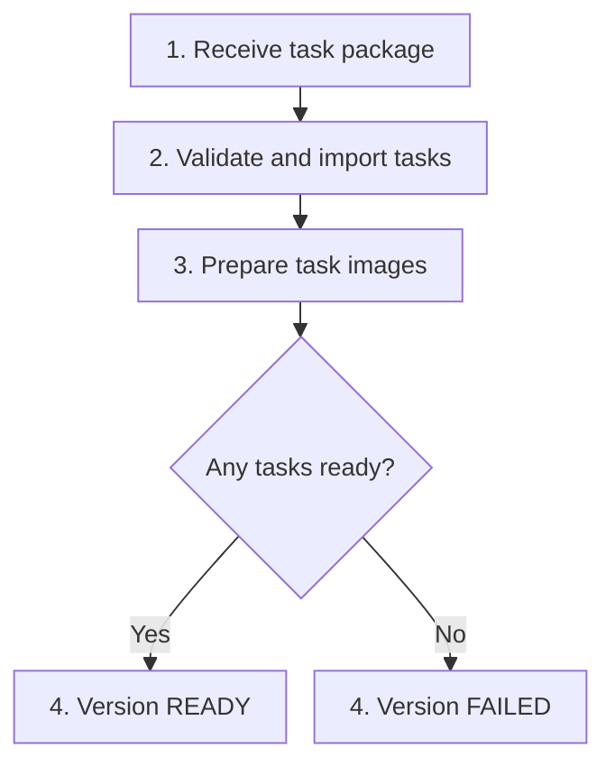

A dataset is a named collection of tasks. Use `name@version` for a specific version, or a bare name for the active version.

```bash
evolve dataset list
evolve dataset show harbor-examples@1.0
```

`show` lists tasks, timeouts, and provider compatibility. Use `--search <text>` with `list` to narrow the catalog.

## Publish your tasks

```text
my-dataset/
├── hello-world/
│   ├── instruction.md
│   ├── task.toml
│   ├── environment/Dockerfile
│   └── tests/test.sh
└── another-task/
    └── ...
```

You can publish a single task directory, a directory of tasks, or a directory containing `tasks/`.

### 1. Check the configuration

```bash
evolve dataset check ./my-dataset
```

This sends configuration files for validation. It does not upload the corpus or build images. Fix rejected declarations before publishing.

### 2. Publish a version

### Local directory

```bash
evolve dataset publish \
  --dir ./my-dataset \
  --name my-dataset --version 1.0 \
  --watch
```

### Git repository

```bash
evolve dataset publish \
  --git https://github.com/acme/my-dataset.git \
  --ref v1.0.0 \
  --name my-dataset --version 1.0 \
  --watch
```

Use a tag or full 40-character commit SHA. Branch names are rejected. `--path <folder>` selects a subdirectory.

### Harbor Hub

```bash
evolve dataset publish --from hub:cookbook/hello-world --watch
```

Public Harbor Hub packages supply their own name and version. `--from` also accepts a public HTTPS tarball URL.

The dataset is private to your organization. Its owner can publish more versions under the same name.

### 3. Inspect the result

```bash
evolve dataset show my-dataset@1.0
```

Check both ready and failed task counts. If you disconnect during publication, use `evolve dataset watch my-dataset` to resume watching.

## What publication does



Tasks build independently. A version can be `READY` while some tasks failed. Whole-dataset and glob selections run its ready tasks and report `build_exclusions`; explicitly selecting a failed task rejects the job.

A ready version becomes active on your dataset. Publishing a new version label leaves the previous active version in place if the new publication fails.

Use a new version label for changed tasks. Publishing an existing label re-imports it in place, so `name@version` selects a label rather than immutable content.

**Note:** Configuration validation cannot prove that images build or tests are correct. Run [task checks](/core-concepts/check) to inspect task quality.

## Pin or switch versions

```bash
# Run an exact version.
evolve run -d my-dataset@1.0 -a codex -m gpt-5.6-luna

# Change what the bare name resolves to.
evolve dataset activate my-dataset 1.0
```

Only ready versions accept jobs. Jobs record the version they resolve when created.

## Download your source package

```bash
evolve dataset download my-dataset@1.0 -o ./corpora
```

The download includes the original corpus and its `solution/` files. It is owner-only; platform datasets are not downloadable through this command.

## dataset.toml manifest

An optional `dataset.toml` selects the tasks in a package and pins their content. Put it beside the task directories. If the package contains `tasks/`, a manifest in `tasks/dataset.toml` takes precedence over one at the package root.

```toml
schema_version = "1.0"

[dataset]
name = "acme/my-dataset"
version = "1.0"
description = "Our coding tasks"
authors = [{ name = "Acme", email = "evals@example.com" }]
keywords = ["coding"]

[[tasks]]
name = "acme/hello-world"
digest = "sha256:<task-content-hash>"

[[files]]
path = "README.md"
# Optional: digest = "sha256:<file-content-hash>"
```

Replace the task digest placeholder with the helper's output below before publishing. A local package with a valid manifest can supply the publication name and version:

```bash
evolve dataset publish --dir ./my-dataset --watch
```

The catalog name comes from the short part (`my-dataset`); the `acme/` prefix does not choose the owning Evolve team. Explicit `--name` and `--version` values win. Without a manifest version, pass `--version`. Git and HTTPS archive sources still require explicit publication name and version; public Harbor Hub packages supply defaults.

### Manifest fields and selection rules

| Field | Accepted value and behavior |
| --- | --- |
| `schema_version` | String, default `"1.0"`. |
| `dataset.name` | Required `org/name`. Each part starts with a letter or digit and contains only letters, digits, `.`, `_`, or `-`; `..` is forbidden. |
| `dataset.version` | Optional nonempty string. |
| `dataset.description` | String, default `""`. |
| `dataset.authors` | Array of tables with required nonempty `name` and optional string `email`; default `[]`. |
| `dataset.keywords` | Array of strings, default `[]`. |
| `tasks` | Required nonempty array. Each entry has `name` in the same `org/name` grammar and a required `digest`: `sha256:` followed by 64 lowercase hex characters. |
| `files` | Optional array. Each entry has a simple filename `path` (no directory separators) and optional `digest` in the same SHA-256 spelling. Empty or omitted digest skips hashing that file. |

Unknown root and `[dataset]` fields are rejected. Each listed dataset file must exist beside the manifest, even without a digest.

Task matching first uses an exact string match against `[task].name` in a local `task.toml`, then falls back to the reference's short name matching a task directory. Only listed tasks are imported. Every reference must resolve locally; missing tasks are not fetched from a registry.

Duplicate identical name/digest pairs are collapsed. An ambiguous declared task name, or references mapping the same directory to different digests, rejects the manifest. Missing tasks and any task/file digest mismatch fail publication.

### Compute a task content digest

Task digests use Harbor's content-hash algorithm, not the archive hash or a hash of `task.toml` alone. The helper below requires Python and `pathspec`:

```bash
python3 -m pip install 'pathspec==1.0.3'
python3 - ./my-dataset/hello-world <<'PY'
import hashlib
import sys
from pathlib import Path
import pathspec

root = Path(sys.argv[1])
paths = [root / name for name in
         ("task.toml", "instruction.md", "README.md", "trajectory.json")
         if (root / name).is_file()]
for name in ("environment", "tests", "solution", "steps"):
    paths.extend(path for path in (root / name).rglob("*") if path.is_file())
ignore_file = root / ".gitignore"
patterns = (ignore_file.read_text().splitlines() if ignore_file.is_file() else
            ["__pycache__/", "*.pyc", ".DS_Store", "*.swp", "*.swo", "*~"])
ignored = pathspec.PathSpec.from_lines("gitignore", patterns)
digest = hashlib.sha256()
for path in sorted(paths, key=lambda path: path.relative_to(root).as_posix()):
    relative = path.relative_to(root).as_posix()
    if any(part.startswith("._") and part != "._" for part in path.relative_to(root).parts):
        continue
    if ignored.match_file(relative):
        continue
    file_hash = hashlib.sha256(path.read_bytes()).hexdigest()
    digest.update(f"{relative}\0{file_hash}\n".encode())
print("sha256:" + digest.hexdigest())
PY
```

The hash covers the four listed root files when present and regular files recursively under `environment/`, `tests/`, `solution/`, and `steps/`. Other root files are outside this digest. Paths are relative, use `/`, and sort lexicographically. For each file, the outer SHA-256 receives its path, a NUL byte, the lowercase SHA-256 of its bytes, and a newline.

A task's `.gitignore` supplies the filters when present; otherwise the default patterns shown above apply. This uses PathSpec's `gitignore` pattern semantics, which differ from Git's directory re-inclusion behavior. macOS `._` sidecars are skipped. Use regular files: publication does not support task symlinks.

Dataset-level `[[files]]` digests are simpler: prefix the SHA-256 of that file's bytes with `sha256:`. Recompute affected digests whenever you edit content.

### Package details

Local publication preserves executable permissions and dotfiles. It excludes `.git`, `.DS_Store`, `.venv`, and symlinks.

Custom `metric.py` dataset metrics are not supported. A script beside the manifest or listed in `files` rejects publication; use the platform's metrics.

Large local uploads are resumable. During receipt, the import can be `QUEUED` with `receiving: true`; it starts building after the corpus arrives.

### Ownership and updates

A dataset name belongs to its first publisher. Another owner cannot publish under that name.

The SDK supports deleting an owned dataset, but deletion is rejected once a job references it. The CLI has no dataset delete command.

Git-backed datasets can report when their source tag moves. Automatic upstream import is opt-in through the SDK's `datasets().update()`; a normal publication does not enable it.

**[Dataset commands](/cli-reference/dataset)**

Sources, validation, publication, and downloads.

**[Dataset SDK](/sdk-reference/datasets)**

The Python and TypeScript clients.
