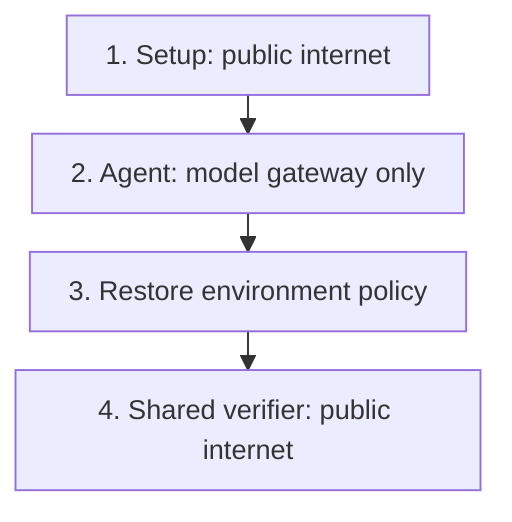

`task.toml` describes what the task needs. Start with a small configuration and add settings when the task depends on them.

```toml task.toml
schema_version = "1.4"
artifacts = ["/app/answer.txt"]

[agent]
timeout_sec = 120

[verifier]
timeout_sec = 60
environment_mode = "shared"

[environment]
cpus = 2
memory_mb = 2048
storage_mb = 10240
workdir = "/app"
network_mode = "no-network"
```

**Note:** `artifacts` is a top-level key. Place it before any `[table]` header, as above.

For every accepted field and default, use the [task.toml reference](/core-concepts/task-reference).

## Time and resources

| Setting | Meaning | Default when omitted |
| --- | --- | --- |
| `agent.timeout_sec` | Maximum agent run time | 3,600 seconds |
| `verifier.timeout_sec` | Maximum verifier run time | 600 seconds |
| `environment.cpus` | Requested CPUs | 2 |
| `environment.memory_mb` | Requested memory | 8,192 MB |
| `environment.storage_mb` | Requested disk | 10,240 MB |
| `environment.gpus` | Requested GPUs | 0 |
| `environment.gpu_types` | Acceptable GPU types | Any type, when GPUs are requested |

A job's `--timeout-multiplier` scales the task timeouts. Provider limits still apply. Use [sandbox capabilities](/core-concepts/sandboxes) to check whether a provider can satisfy the task.

## Network access

| Mode | Agent access |
| --- | --- |
| `public` | Public internet; the default |
| `allowlist` | Declared hosts and the Evolve model gateway |
| `no-network` | Evolve model gateway only |

`allowed_hosts` is valid only alongside `network_mode = "allowlist"`.

```toml task.toml
[environment]
network_mode = "allowlist"
allowed_hosts = ["pypi.org", "files.pythonhosted.org"]
```

### Change access for the agent phase

The environment policy applies during setup and after the agent finishes. An `[agent]` policy can override it while the agent runs.

```toml task.toml
[environment]
network_mode = "public"

[agent]
network_mode = "no-network"
```



A shared verifier uses the restored environment policy. A different `[verifier].network_mode` requires a separate verifier. Its policy resolves from `[verifier.environment]`, or a copy of `[environment]` when that table is absent, then applies any `[verifier]` override.

The legacy `allow_internet = false` means `no-network`; `true` means `public`. An explicit `network_mode` takes precedence.

## Environment variables

```toml task.toml
[environment.env]
APP_MODE = "test"
GITHUB_TOKEN = "${GITHUB_TOKEN}"
LOG_LEVEL = "${LOG_LEVEL:-info}"
```

| Value | How it resolves |
| --- | --- |
| `"test"` | Literal value stored with the dataset |
| `"${GITHUB_TOKEN}"` | A [secret attached to the job](/core-concepts/secrets) under that environment name |
| `"${LOG_LEVEL:-info}"` | An attached secret, or the fallback `info` |

Templates must occupy the whole value. A missing required secret rejects job creation. Keep credentials out of literal values: dataset contents are not a secret store.

The image's startup process receives literals only. Secret templates are resolved for the agent and processes it launches. Healthchecks never receive secret templates; a single-container healthcheck also does not receive the task's literal table.

## Save outputs

For separate verification, `artifacts` names the files or directories to copy into the verifier sandbox. Retained files also appear in the job archive. A shared verifier reads the agent's existing filesystem directly and does not export this artifact list; use the [filesystem commands](/core-concepts/trial-outputs#sandbox-files) to inspect live or captured files.

```toml task.toml
artifacts = [
  "/app/answer.txt",
  { source = "/app/reports", destination = "reports", exclude = ["*.tmp"] }
]
```

Sources are absolute paths. `destination` is relative to the stored `artifacts/` directory. It does not change the source path used to restore a file in a separate verifier.

See [verification and artifacts](/core-concepts/task-verifiers#separate-verification) for a complete example.

## Start from a saved conversation

Put a valid ATIF `trajectory.json` beside the instruction. Evolve loads it as the agent's conversation history before giving it the new instruction. This works with **Claude Code and Codex**.

```text
my-task/
├── instruction.md       What to do next
├── trajectory.json      Earlier conversation
├── task.toml
├── environment/
└── tests/
```

Only the conversation is restored. Put any files it depends on in the task environment. An invalid trajectory is rejected during import; a harness that cannot load it is rejected before the agent runs.

### Minimal text-only ATIF seed

```json trajectory.json
{
  "schema_version": "ATIF-v1.7",
  "agent": {"name": "example", "version": "1.0"},
  "steps": [
    {"step_id": 1, "source": "user", "message": "Use Quarterly review as the report title."},
    {"step_id": 2, "source": "agent", "message": "I will use that title."}
  ]
}
```

This authored example supplies conversation context; it does not create a report file. The next instruction can ask the agent to use the earlier title.

Imports accept `ATIF-v1.0` through `ATIF-v1.7`. Steps are numbered from 1 in order. Evolve converts the document into the selected harness's session format. Multimodal content is reduced to text; image parts become placeholders.

There is no trajectory setting in `task.toml` or run-level load flag in Evolve. For [multi-step tasks](/core-concepts/multi-step), place the trajectory beside the first step's instruction; later steps start fresh.

## Other task inputs

| Input | Purpose |
| --- | --- |
| `environment.skills_dir` | [Package skills with the task](/core-concepts/skills#package-skills-with-a-task) |
| `pre_artifacts.sh` | [Prepare collected outputs](/core-concepts/task-verifiers#prepare-outputs-for-collection) after the agent finishes |
| `[metadata]` | Store descriptive fields; `metadata.task_id`, when set, must match the task directory name |

## Validate before publishing

```bash
evolve dataset check ./my-dataset
```

This checks task configuration without uploading the corpus or building images. A successful check does not prove that an image builds or that the verifier is correct. Use [task checks](/core-concepts/check) for the latter.
