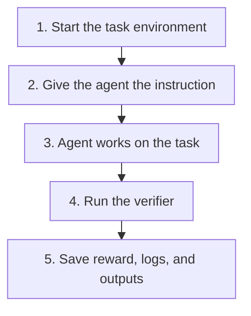

A task is one problem for an agent to solve. It packages an instruction, a Linux environment, and a verifier that scores the result.

Evolve accepts the **Harbor task format**, with the [managed capabilities and limits](/core-concepts/compatibility) described in these guides.

**Tip:**

New to task authoring? [Build your first task](/getting-started/first-task) from five small files.

- my-task/
  - instruction.md
  - task.toml
  - environment/
    - Dockerfile
  - tests/
    - test.sh
  - solution/
    - solve.sh

| File | Purpose |
| --- | --- |
| `instruction.md` | What the agent must do |
| `task.toml` | Timeouts, resources, and policies |
| `environment/Dockerfile` | Tools and files available to the agent |
| `tests/test.sh` | Checks the work and writes a reward |
| `solution/solve.sh` | Optional reference solution |

For a single-step task, `instruction.md`, `task.toml`, and a nonempty `tests/test.sh` are required. Define the environment with a Dockerfile, a pinned image, or supported Docker Compose configuration.

## What happens in a trial



The agent receives the instruction and environment. The verifier and reference solution are not handed to it as task inputs.

## Write a clear instruction

State the requested change, the output path, and the conditions for success. The verifier should check those same conditions.

```markdown instruction.md
Create /app/answer.txt containing exactly:

Hello, world!

End the file with a newline.
```

Use absolute paths when the location matters. A benchmark canary marker is removed before the instruction reaches the agent.

## Add a reference solution

`solution/solve.sh` demonstrates a correct answer. For the instruction above:

```bash solution/solve.sh
#!/bin/bash
printf 'Hello, world!\n' > /app/answer.txt
```

Keep it separate from the environment image. [Task checks](/core-concepts/check) can use it to test whether the verifier accepts a valid solution.

## Build the rest

**[Environment](/core-concepts/task-environment)**

Images, working directories, services, and MCP tools.

**[Verifier](/core-concepts/task-verifiers)**

Write a reward and choose where grading runs.

**[Configuration](/core-concepts/task-config)**

Resources, network access, variables, and timeouts.

**[Multiple steps](/core-concepts/multi-step)**

Continue work across ordered instructions in one environment.

When the task is ready, [publish it as a dataset](/core-concepts/datasets).
